# Fork a GitHub repository and clone onto the VRE

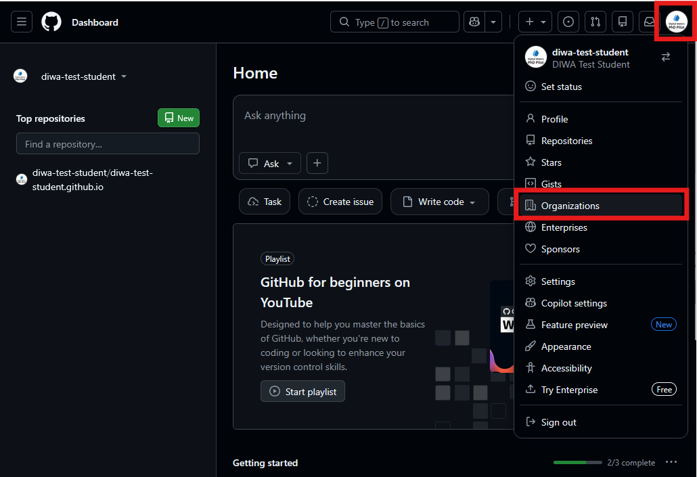

> Open the user menu in the upper right on GitHub, and navigate to your Organizations page

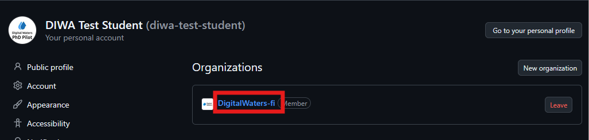

> Select the `DigitalWaters-fi` organization

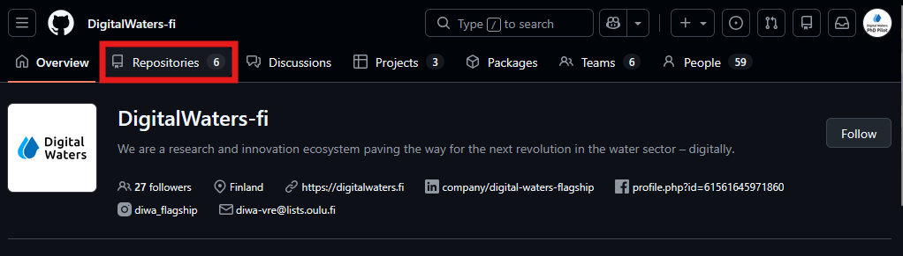

> Navigate to the `Repositories` tab


> Select the `WaterDig` repository

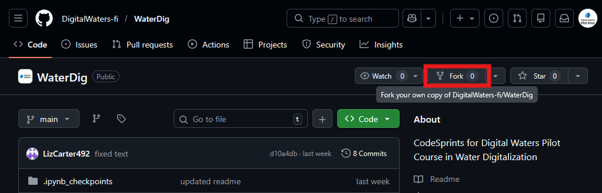

> Click the `Fork` button 

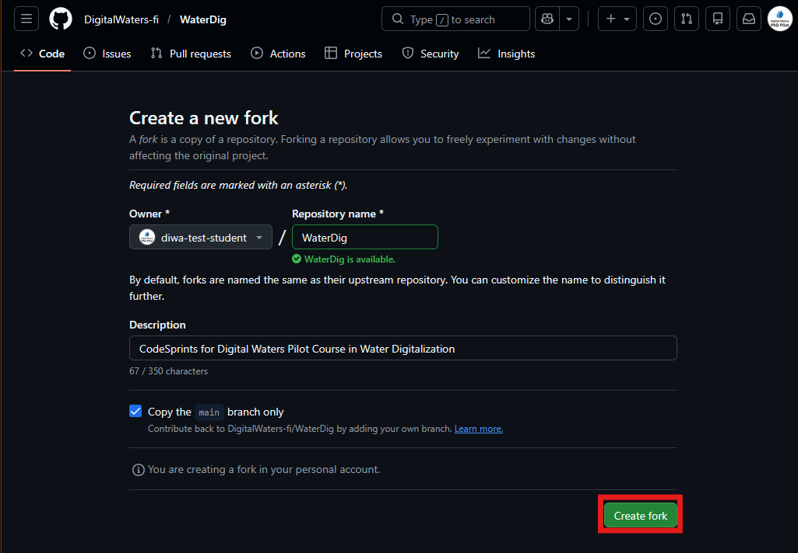

> Confirm your fork. You do not need to make any changes.

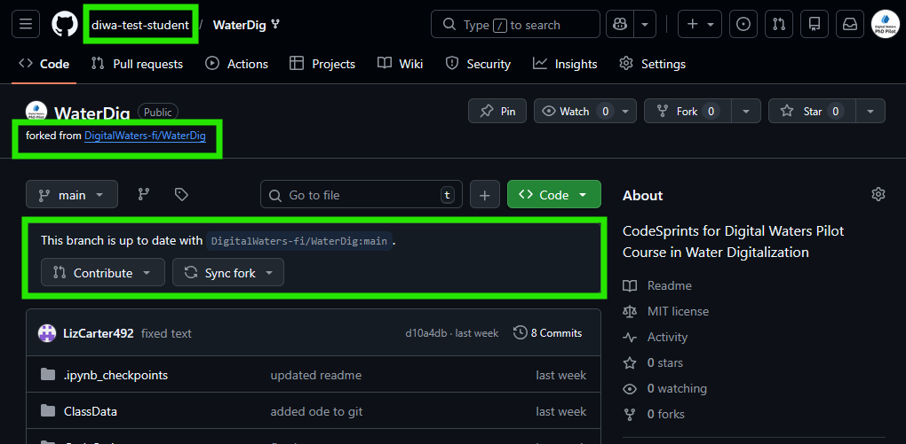

> You should now be in *your* fork of the repository! You can check in the upper left that you are in *your* account and no longer in DigitalWaters-fi

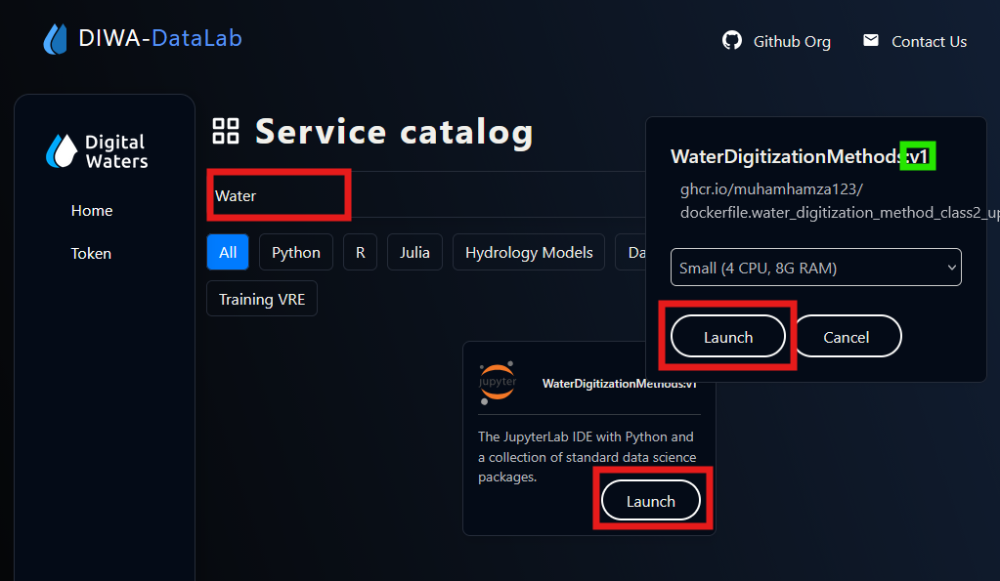

> Navigate to the DIWA VRE and launch a WaterDigitalization image

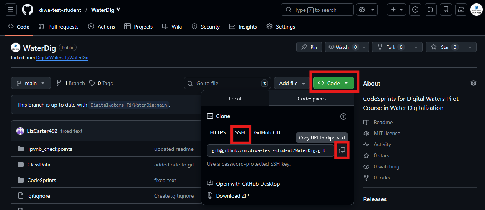

> Copy the url for *your* fork. Make sure to select the correct type of authentication (HTTPS or SSH) to match the way you configured your account on the VRE before copying!

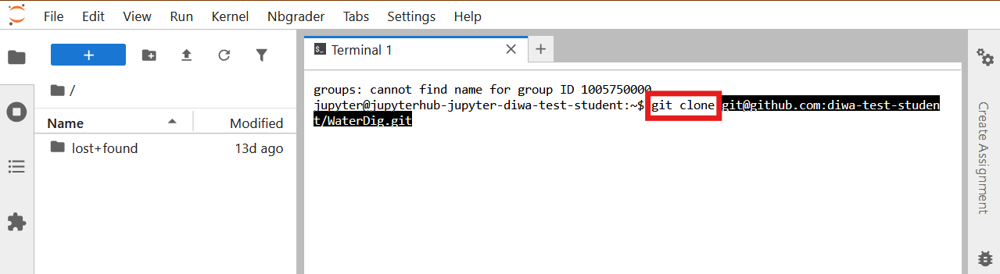

> Open a Terminal window in the VRE and clone your repository with the `git clone <url>` command, replacing `<url>` with the url you copied.

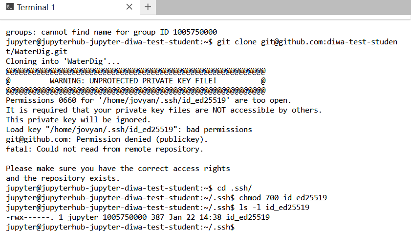

> Oops! Looks like your SSH key has insufficient permissions, and GitHub won't accept it as strong authentication! You'll need to use the `chmod` command to change the permissions

Use the following command to change the permissions:

```bash
chmod 600 ~/.ssh/id_ed25519
```

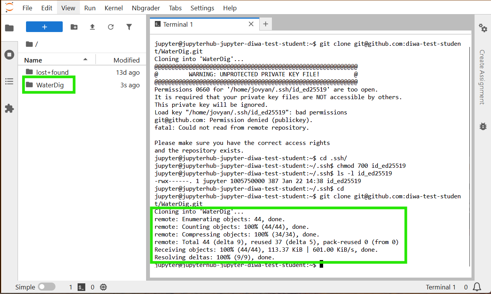

> Now, you can try cloning again and it should go through (provided your SSH setup was correct). TIP -- you can get that command back in the Terminal without needing to type it again by using the up arrow!
