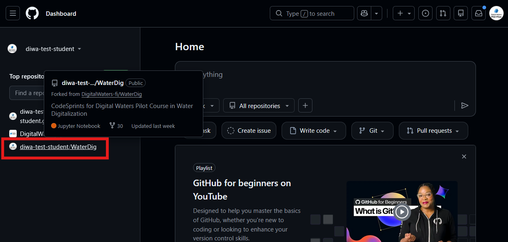
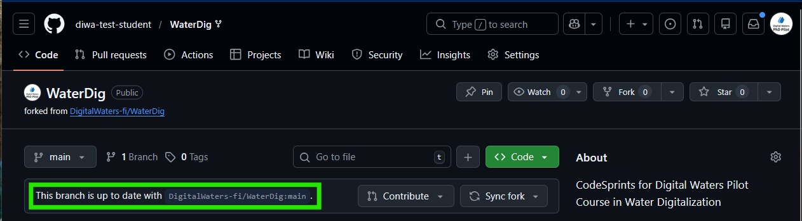

> On GitHub.com, navigate to YOUR forked repository. Make sure it is the repository in your GitHub account, not the original repository that you forked!

> Click on `Sync fork`, and then `Update branch`

> Your repository should now say that you are up to date with the original repository.
